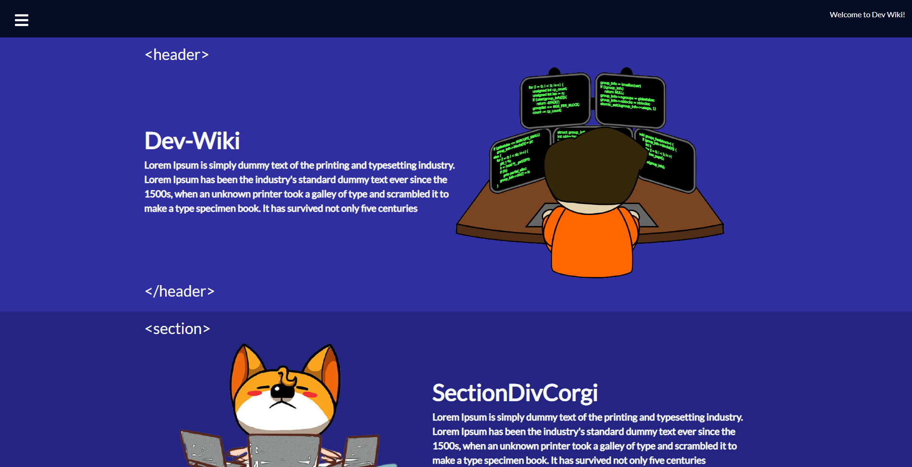
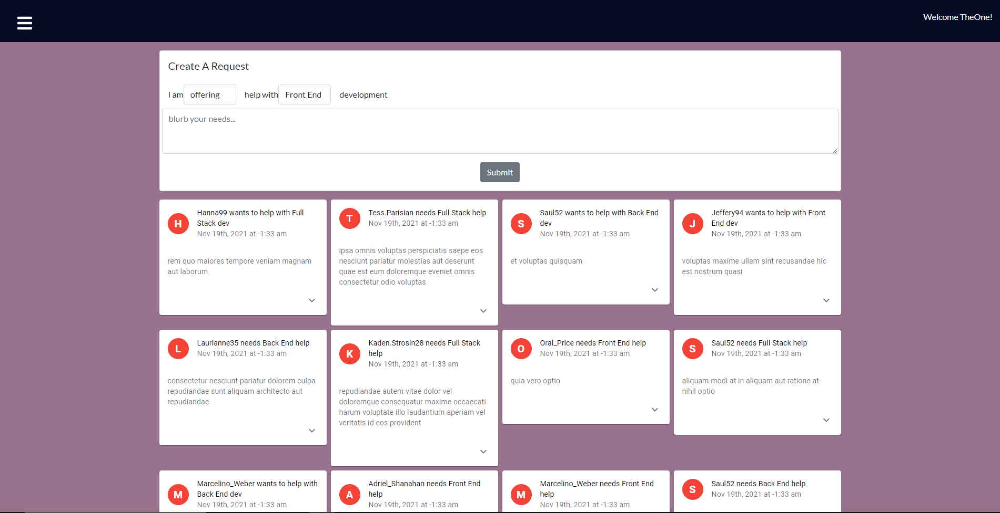

# _Dev-Wiki_
> _A platform where rookie developers could not only seek out help, but also offer (not necessarily monetized) assistance for the sake of practice and continuous learning_.
> Live demo [_here_](https://dev-wiki-io.herokuapp.com/). 

## Table of Contents
* [Technologies Used](#technologies-used)
* [Modules Used](#modules-used)
* [Features](#features)
* [Screenshot](#screenshot)
* [Project Status](#project-status)
* [Room for Improvement](#room-for-improvement)

## Technologies Used
- HTML/CSS
- Git
- JavaScript
- React.js
- MongoDB

## Modules Used
- react-icons
- apollo-server-express
- express
- faker
- jsonwebtoken
- mongoose
- apollo/client
- graphql
- bcrypt
- jwt-decode

## Screenshot
### Dev-Wiki:

## Features
Ready Features:
1. **Allows users to create a request where they can explain the work they need done to developers**
     
 

## Project Status
Project is: _in progress_

## Room for Improvement
Room for improvement:
- TBD

To do:
- Third-party authentication
- Search Filtering (Front End, Back End, Full Stack)
- Separate Push(offering service) and Pull (needing services) requests
- Edit post/reaction capabilities
- Payment within the application for services provided
- Adding a budget for services needed
- Adding an archived or resolved posts filter

